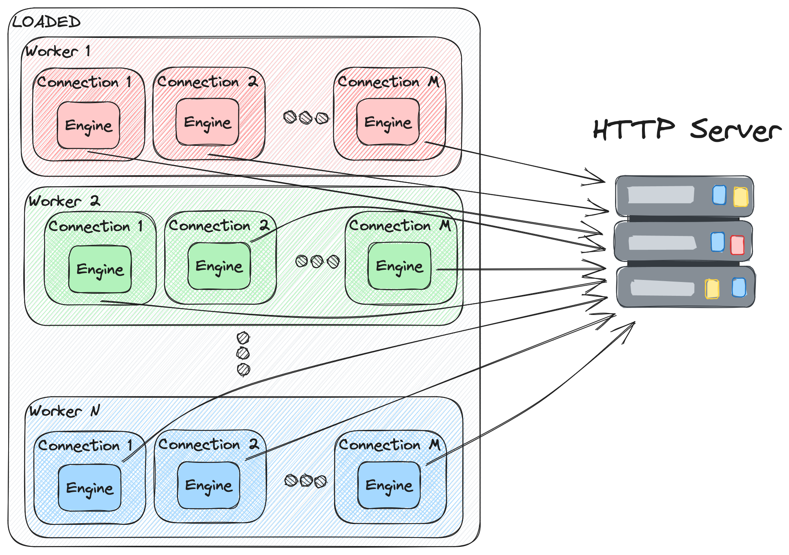

# Design

## Architecture

There are three main concepts in the architecture:

- Workers
- Connections
- Engines

### Worker

A worker is in charge of the care and feeding of the asynchronous runtime and the connections that are running underneath it. By default, it will create a worker per physical CPU Core. Each worker is aimed to be as independent of sibling workers as possible to adhere to a thread-per-core model with a minimized amount of shared resources.

### Connection

A connection is responsible for maintaining the underlying tcp connection and repeatedly issuing http requests to the http server. These requests are formed by engine hooks that define what requests are sent and what is to be done with the response.

### Engine

An engine implements key hooks in the lifecycle of an HTTP request that let it dictate the workload that is generated and sent to the http server. 

- **setup**: one time setup for the engine
- **request**: allows the engine to build up a request to be sent
- **response**: allows the engine to parse the incoming request
- **cleanup**: one time cleanup before the engine exits

## Bootstrap

At start time, N workers are kicked off, with each worker containing a tokio runtime. Within each worker's async runtime, the worker kicks off M different connections each driving http traffic to the target server using a workload defined by the engine.